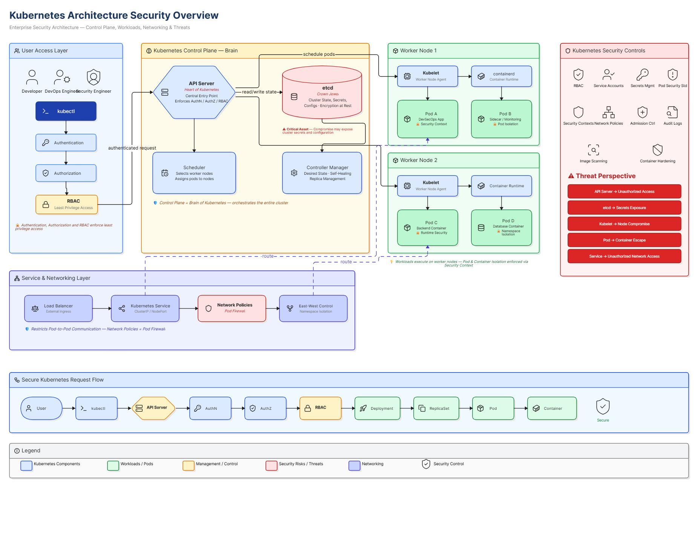

# Kubernetes Architecture Security Overview

## Overview

This project is part of my Cybersecurity Home Lab Journey and focuses on understanding Kubernetes architecture from a security engineering perspective.

The objective of this lab is not only to understand how Kubernetes components work together, but also to identify critical security boundaries, trust relationships, attack surfaces, and security controls used in enterprise Kubernetes environments.

---

## Architecture Diagram

> Replace the image path below with your actual diagram.

```markdown

```

---

# Learning Objectives

After completing this lab, I was able to understand:

* Kubernetes Cluster Architecture
* Control Plane Components
* Worker Node Components
* Pod Lifecycle
* Deployment and ReplicaSet Relationships
* Service-Based Networking
* API Server Security Model
* RBAC Fundamentals
* etcd Security Importance
* Kubelet Responsibilities
* Kubernetes Attack Surface
* Enterprise Security Controls

---

# Kubernetes Cluster Architecture

A Kubernetes Cluster consists of two primary layers:

## Control Plane

The Control Plane acts as the brain of Kubernetes and is responsible for making cluster-wide decisions.

Responsibilities:

* Scheduling workloads
* Managing cluster state
* Enforcing security controls
* Maintaining desired state
* Processing API requests

### Components

* API Server
* etcd
* Scheduler
* Controller Manager

---

## Worker Nodes

Worker Nodes are responsible for running application workloads.

Responsibilities:

* Running Pods
* Executing containers
* Reporting health information
* Communicating with the Control Plane

### Components

* Kubelet
* Container Runtime
* Pods
* Containers

---

# User Access Flow

A user interacts with Kubernetes using:

```bash
kubectl
```

Request Flow:

```text
User
   ↓
kubectl
   ↓
API Server
   ↓
Authentication
   ↓
Authorization
   ↓
RBAC
   ↓
Cluster Resources
```

Every operation performed in Kubernetes ultimately passes through the API Server.

---

# Control Plane Components

## 1. API Server

### Purpose

The API Server acts as the central entry point of the Kubernetes cluster.

### Responsibilities

* Receives kubectl requests
* Validates requests
* Authenticates users
* Authorizes actions
* Enforces RBAC
* Communicates with etcd
* Manages cluster operations

### Security Importance

The API Server is considered the heart of Kubernetes.

If compromised:

* Cluster administration becomes possible
* Workloads can be modified
* Secrets can be accessed
* Malicious workloads can be deployed

### Security Controls

* TLS Encryption
* Authentication
* Authorization
* RBAC
* Audit Logging

---

## 2. etcd

### Purpose

etcd is the distributed key-value database used by Kubernetes.

### Stores

* Pods
* Deployments
* Services
* ConfigMaps
* Cluster State
* Secrets

### Security Importance

etcd is considered the Crown Jewel of Kubernetes Security.

If compromised:

* Secrets may be exposed
* Cluster configuration may be exposed
* Full cluster state becomes accessible

### Security Controls

* Encryption at Rest
* Restricted Access
* Network Isolation
* Regular Backups

---

## 3. Scheduler

### Purpose

The Scheduler determines where Pods should run.

### Responsibilities

* Selects Worker Nodes
* Evaluates resources
* Places workloads efficiently

Example:

```text
Node-1 Busy
Node-2 Busy
Node-3 Available

Scheduler
      ↓
Pod Assigned to Node-3
```

---

## 4. Controller Manager

### Purpose

Maintains the desired state of the cluster.

### Responsibilities

* Self-Healing
* Replica Management
* Node Monitoring
* Workload Recovery

Example:

```text
Desired Pods = 3

Pod Failure
      ↓
Controller Manager
      ↓
New Pod Created
```

---

# Worker Node Components

## 1. Kubelet

### Purpose

Kubelet is an agent running on every Worker Node.

### Responsibilities

* Communicates with API Server
* Receives Pod Instructions
* Monitors Pods
* Reports Node Status

### Security Importance

Compromise of Kubelet may lead to:

* Node Compromise
* Pod Access
* Workload Manipulation

---

## 2. Container Runtime

### Examples

* containerd
* CRI-O

### Responsibilities

* Pull Images
* Start Containers
* Stop Containers
* Manage Runtime Operations

---

# Pods

## What is a Pod?

A Pod is the smallest deployable unit in Kubernetes.

A Pod may contain:

* One Container
* Multiple Containers

Example:

```text
Pod
 └── Application Container
```

or

```text
Pod
 ├── Application Container
 └── Monitoring Sidecar
```

### Security Importance

Pods represent the primary workload boundary in Kubernetes.

Security controls include:

* Security Contexts
* Resource Limits
* Pod Security Standards
* Network Policies

---

# Deployments and ReplicaSets

## Deployment

Deployment manages application lifecycle.

Responsibilities:

* Pod Creation
* Rolling Updates
* Rollbacks
* Scaling

Example:

```yaml
replicas: 3
```

---

## ReplicaSet

Ensures the required number of Pods remain running.

Example:

```text
Desired Pods = 3

Pod Deleted
      ↓
ReplicaSet
      ↓
New Pod Created
```

---

# Kubernetes Services

## Purpose

Services provide a stable endpoint for Pods.

Without Services:

```text
Pod IP Changes
Application Breaks
```

With Services:

```text
User
  ↓
Service
  ↓
Pods
```

### Benefits

* Service Discovery
* Load Balancing
* Stable Connectivity

---

# Service Types

## ClusterIP

Internal access only.

Used for:

* Backend Services
* Databases

---

## NodePort

Exposes services through a node port.

Example:

```text
NodeIP:30080
```

---

## LoadBalancer

Commonly used in cloud environments.

Example:

* AWS Load Balancer
* Azure Load Balancer

---

# Kubernetes Security Controls

## Authentication

Verifies identity.

Question:

```text
Who are you?
```

Examples:

* Users
* Service Accounts
* Administrators

---

## Authorization

Determines permissions.

Question:

```text
What are you allowed to do?
```

---

## RBAC (Role-Based Access Control)

RBAC enforces least privilege access.

Example:

| Role          | Permission              |
| ------------- | ----------------------- |
| Developer     | View Pods               |
| Security Team | View Security Resources |
| Admin         | Full Cluster Access     |

### Security Benefit

Reduces excessive privileges and limits attack impact.

---

# Network Security

## Network Policies

Network Policies act as a firewall for Pods.

Example:

Allowed:

```text
Frontend → Backend
```

Allowed:

```text
Backend → Database
```

Blocked:

```text
Frontend → Database
```

### Security Benefit

* Reduces lateral movement
* Limits unauthorized communication
* Implements Zero Trust principles

---

# Common Kubernetes Attack Surfaces

## API Server

Risk:

* Unauthorized Access
* Misconfigured Authentication

---

## etcd

Risk:

* Secret Exposure
* Cluster State Disclosure

---

## Kubelet

Risk:

* Node Compromise
* Pod Manipulation

---

## Containers

Risk:

* Container Escape
* Privilege Escalation

---

## Network

Risk:

* Lateral Movement
* Unauthorized Access

---

# Enterprise Security Best Practices

## Control Plane

* Enable RBAC
* Restrict API Server Access
* Encrypt etcd
* Enable Audit Logging
* Backup etcd Regularly

## Worker Nodes

* Use Hardened Images
* Restrict SSH Access
* Patch Nodes Regularly
* Monitor Kubelet Activity

## Workloads

* Run as Non-Root
* Use Security Contexts
* Apply Resource Limits
* Scan Images Regularly

## Networking

* Implement Network Policies
* Use Namespace Isolation
* Restrict East-West Traffic

---

# Kubernetes Security Flow

```text
User
   ↓
kubectl
   ↓
API Server
   ↓
Authentication
   ↓
Authorization
   ↓
RBAC
   ↓
Deployment
   ↓
ReplicaSet
   ↓
Pod
   ↓
Container
```

---

# Key Takeaways

* Control Plane is the brain of Kubernetes.
* API Server is the central entry point for all operations.
* etcd is the most sensitive component because it stores cluster state and secrets.
* Kubelet manages workloads on Worker Nodes.
* Pods are the smallest deployable units.
* Deployments and ReplicaSets provide self-healing capabilities.
* Services enable stable networking and load balancing.
* RBAC is one of the most important security controls.
* Network Policies help restrict Pod-to-Pod communication.
* Kubernetes security focuses on protecting the Control Plane, Worker Nodes, and Workloads.

---

## Author

Karan Singh Rajawat

Cybersecurity Home Lab Journey

Phase 3 – Kubernetes Security

Part 9A – Kubernetes Architecture Security Overview
